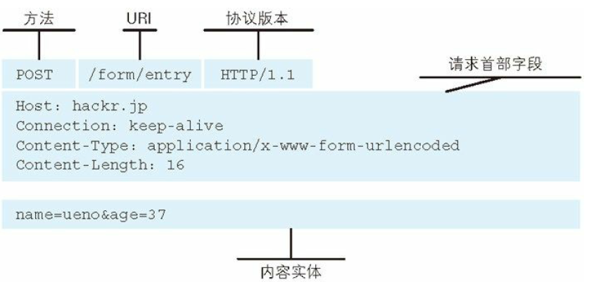
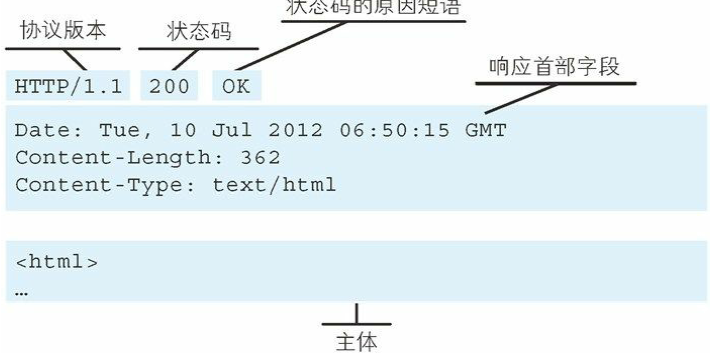
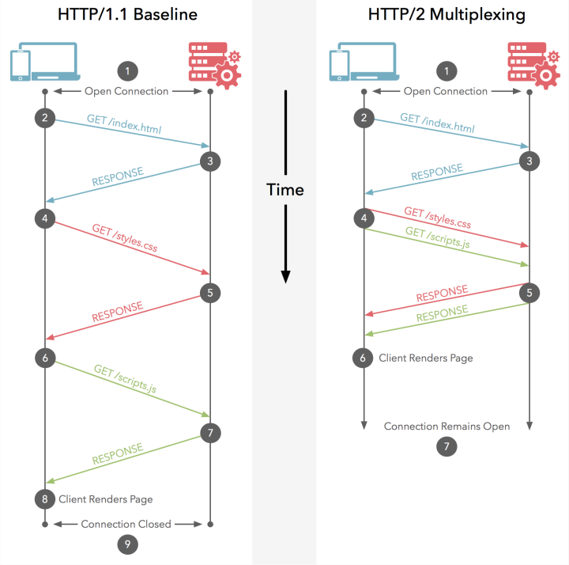

# HTTP

（HyperText Transfer Protocol）超文本传输协议

## 1.Web及网络基础

### URL 和 URI

* URI(Uniform Resource Identifier)统一资源标识符

  URI 就是由某个协议方案表示的资源的定位标识符。协议方案是指访问资源所使用的协议类型名称。

* URI 用字符串标识某一互联网资源，而 URL 表示资源的地点（互联网上所处的位置）。可见 URL 是 URI 的子集。

* URI格式： 

  协议方案：//登录信息（用户:密码）@服务器地址：端口号/带层次的文件路径？查询字符串#片段标识符

  片段标识符：通常可标记出已获取资源中的子资源（文档内的某个位置）。但在 RFC 中并没有明确规定其使用方法。该项也为可选项。

## 2.HTTP协议基础

### 请求响应格式

* http请求格式

<center></center>

* http响应格式

  <center></center>

### HTTP是无状态的协议

* HTTP 是stateless的，自身**不具备保存之前发送过的请求或响应的功能**。这是为了更快地处理大量事务，确保协议的可伸缩性。
* 但为了实现期望的保持状态功能，于是引入了 Cookie 技术。有了 Cookie 再用 HTTP 协议通信，就可以管
  理状态了。

### HTTP的方法

<center></center>

* POST 客户端主动发送一个数据给服务器，常见格式是JSON

* PUT 愿意是传输文件，但是HTTP服务器往往不允许上传文件，所以PUT和POST用法类似，都是上传一个数据

* POST一般用来创建一个资源，PUT往往用来修改一个资源

* GET POST的区别：

  GET将请求参数放到URL中 POST将请求参数放在请求体中

  GET用于获取信息，可缓存；POST用于修改服务器上的数据，不可缓存；

  

### HTTP的持久连接

* 为了避免对每次http请求都新建tcp连接，减少资源的消耗，提高请求的响应速度，所以使用持久连接，**keep-alive**

  只要任意一端没有明确提出断开连接，则保持 TCP 连接状态。

### Cookie

* Cookie 会根据从**服务器端**发送的响应报文内的一个叫做**Set-Cookie **的首部字段信息，通知客户端保存 Cookie。

* 当下次客户端再往该服务器发送请求时，客户端会自动在请求报文中加入 Cookie 值(一个ID，位置在请求首部中)后发送出去。

* 服务器端发现客户端发送过来的 Cookie 后，会去检查究竟是从哪一个客户端发来的连接请求，然后对比服务器上的记录，最后得到之前的状态信息。

* cookie session的区别与联系

  都记录用户请求状态

  * cookie数据存放在客户的浏览器上，session数据放在服务器上。
  * **cookie不是很安全**，别人可以分析存放在本地的COOKIE并进行COOKIE欺骗

     考虑到安全应当使用session。

  * session会在一定时间内保存在服务器上。当访问增多，会比较占用你服务器的性能

     考虑到减轻服务器性能方面，应当使用COOKIE。

  * 单个cookie保存的数据**不能超过4K**，很多浏览器都限制一个站点最多保存20个cookie。

## 3. HTTP报文内的HTTP信息

### 请求相应报文结构

* 请求/响应报文 首部与报文主体之间用空行（CR+LF，回车+换行，回车‘\r’，换行'\n'）连接

### 编码提升传输速率

* HTTP 在传输数据时可以按照数据原貌直接传输，但也可以在传输过程中通过编码提升传输速率。通过在传输时编码，能有效地处理大量的访问请求。但是编码消耗CPU资源

* 常用的编码方式

  * gzip(GUN zip)
  * compress(UNIX系统标准压缩)
  * deflate(zlib)
  * identity(不进行编码)

* 分块传输编码

  把实体主体分块的功能称为**分块传输编码**（Chunked Transfer Coding）

  MIMI  multipart/form-data,byteranges

### 获取部分内容的范围请求

* range request: 用到请求首部中的**range**字段，来指定希望获得的byte的范围

  如：`Range: bytes=-3000, 5000-7000`请求从一开始到3000的字节&5000-7000字节的多重范围

* 针对范围请求，响应会返回状态码为 **206 Partial Content**的响应报文。另外，对于**多重范围**的范围请求，响应会在首部字段 Content-Type 标明**multipart/byteranges** 后返回响应报文。

* 如果服务器端无法响应范围请求，则会返回状态码 **200 OK 和完整的实体内容**。

### 内容协商

* 内容协商的首部字段包括：
  * Accept
  * Accept-Charset
  * Accept-Encoding
  * Accept-Language
  * Content-Language

## 4. HTTP状态码

* http状态码分类

  <center></center>

  * 200 OK
  * 204 No Content 请求相应成功，但是不返回任何实体。
  * 206 Partital Content  对客户端范围请求的响应
  * 301 Moved Permanently 永久性重定向；
  * 302 Found 临时性重定向；该状态码表示请求的资源已被分配了新的 URI，希望用户（本次）能使用新的 URI 访问
  * 303 See Other 303 状态码和 302 Found 状态码有着相同的功能，但 303 状态码明确表示客户端应当采用 GET 方法获取资源，
  * 307 Temporary Redirect 临时重定向，跟302类似
  * 400 Bad Request 请求存在语法错误
  * 401 Unauthorized 请求需要认证/认证失败
  * 403 Forbidden 请求资源的访问被拒绝

## 5. HTTP首部

* HTTP首部可以分为以下四类：

  * 通用首部字段： 请求报文、响应报文都会使用的字段
  * 请求首部字段：从客户端向服务器端发送请求报文时使用的首部。
  * 响应首部字段：从服务器端向客户端返回响应报文时使用的首部。
  * 实体首部字段：针对请求报文和响应报文的实体部分使用的首部。补充了资源内容更
    新时间等与实体有关的信息。

* Connection首部字段

  * 控制不再转发给代理的首部字段，如：

    ```
    GET / HTTP/1.1
    Upgrade: HTTP/1.1
    Connection: Upgrade
    ```

    首部字段中的Upgrade将不再会被转发

  * 管理持久连接

    持久连接： `Connection:Keep-Alive`

    断开连接：`Connection:Close`

* Date首部： 创建HTTP报文的日期、时间

* Transfer-Encoding首部 

  首部字段 Transfer-Encoding 规定了传输报文主体时采用的编码方式。
  HTTP/1.1 的传输编码方式仅对**分块传输编码**有效。

  `Transfer-Encoding: chunked`

* Via  首部字段 Via 是为了追踪客户端与服务器之间的请求和响应报文的传输路径。

  报文经过代理或网关时，会先在首部字段 Via 中附加该服务器的信息(http协议版本+主机名)，然后再进行转发。

* Accept

  Accept 首部字段可通知服务器，用户代理能够处理的媒体类型及媒体类型的相对优先级。

  `Accept: text/html,application/xhtml+xml`

* Accept-Charset: 客户端可以接受的字符集

* Content-Type: 实体的格式

* 为Cookie服务的首部

  * Set-Cookie 响应首部字段中，开始状态管理所使用的Cookie信息
  * Cookie 请求首部，客户端请求附带上的状态信息

## 6. HTTP2.0

http2.0对比http1.1的几个特点：

* **二进制分帧：**

  http2.0中传输的最小单位是帧（frame）,http2.0会将原来http1的数据采用二进制编码，存储到Frame中

  每个frame由frame header(8字节)和frame payload组成，需要传输的数据都存储在frame payload中

  一个frame的结构如下：

  ```
  +-----------------------------------------------+
  |                 Length (24)                   |
  +---------------+---------------+---------------+
  |   Type (8)    |   Flags (8)   |
  +-+-------------+---------------+-------------------+
  |R|                 Stream Identifier (31)          |
  +=+=================================================+
  |                   Frame Payload (0...)        ...
  +---------------------------------------------------+
  ```

  Type: 区分Frame payload内存储的数据类型，如http1的首部会被封装到HEADER Frame中，http1的实体会被封装到Data Frame中

  Stream Identifier:  同一个tcp连接上可以传输双向多个流，多个流的数据帧可以混杂发送，接收端通过Stream ID来拼接成一个请求

  每组http 请求-响应 使用不同的Stream ID加以区别

  http1.1 采用文本方式传输，解析文本健壮性更差

* **首部压缩**

  http请求、响应头中有大量的重复的首部字段，浪费网络资源

  对于出现过的首部字段，不再重新通过每次请求和响应发送。每个新的首部键值对要么追加到当前表的末尾（首部字段也是第一次出现），要么替换表中之前的值（首部字段已经在表中，值更新）。首部表在HTTP2.0的链接存续期内始终存在，由客户端和服务端共同渐进的更新。 

  <center></center>

* **多路复用**

  http1.1虽然改进了http1.0但是对于同一个域名的请求，依然有一定的数量限制，超过这个限制请求就会被阻塞

  http2将通信的基本单位缩小为一个帧，这些帧对应于**逻辑流**中的消息，并行的在一个tcp连接上**双向交换**信息

  <center></center>

* **服务端推送 Server Push**

  服务端推送是一种在客户端请求之前服务端主动发送数据的机制 。在 HTTP/2 中，**服务器可以对客户端的一个请求发送多个响应。** 

  当服务端需要主动推送某个资源时，便会发送一个 Frame Type 为 PUSH_PROMISE 的 Frame，里面带了 PUSH 需要新建的 Stream ID。意思是告诉客户端：接下来我要用这个 ID 向你发送东西，客户端准备好接着。客户端解析 Frame 时，发现它是一个 PUSH_PROMISE 类型，便会准备接收服务端要推送的流。 

  如果一个请求是由你的主页发起的，服务器很可能会响应主页内容、logo 以及样式表，因为它知道客户端会用到这些东西。 

  <center></center>

* 参考

  * [HTTP/2新特性浅析](http://io.upyun.com/2015/05/13/http2/)
  * [HTTP/2.0对比1.1的重大改进](https://www.zhihu.com/question/34074946/answer/75364178)


## 7. HTTPS

* HTTP的缺点：
  * 通信使用明文（不加密），内容可能会被窃听
  * 不验证通信方的身份，因此有可能遭遇伪装
  * 无法证明报文的完整性，所以有可能已遭篡改
  * 

