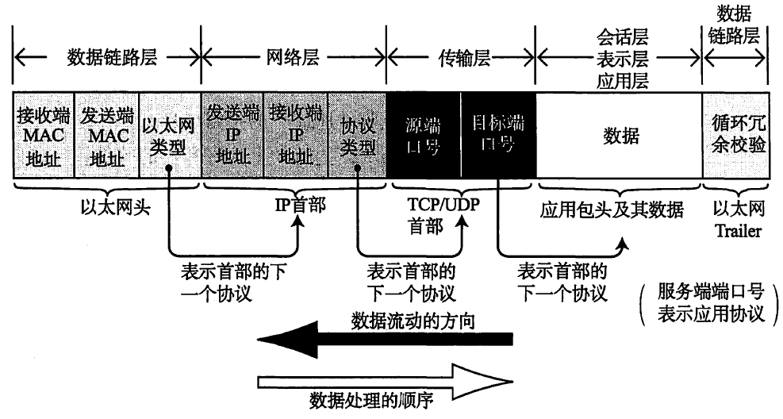
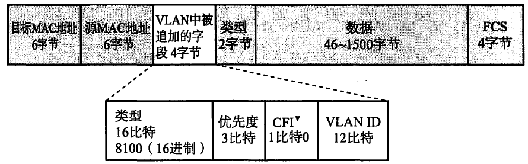
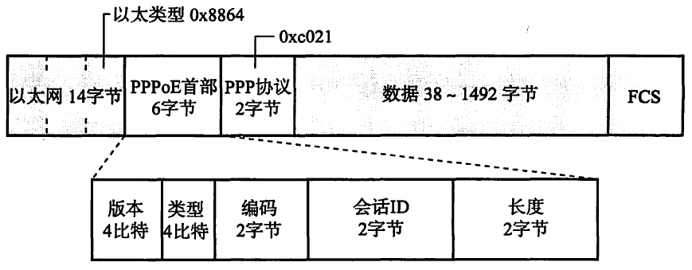
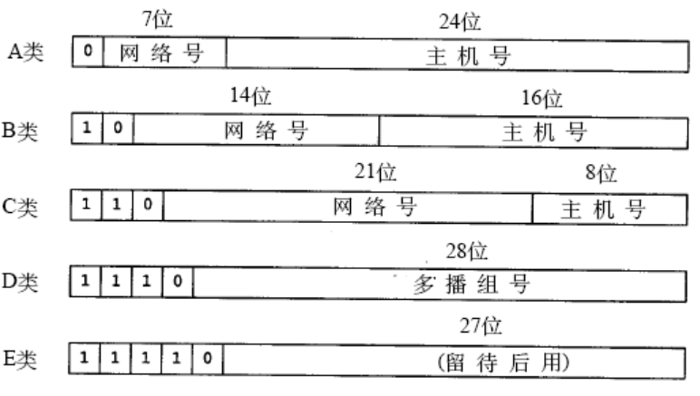
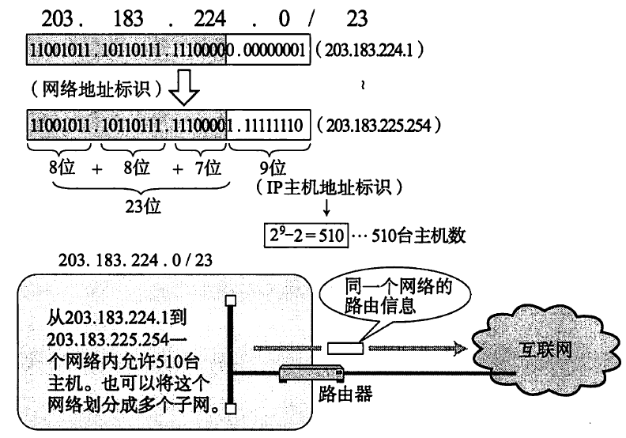
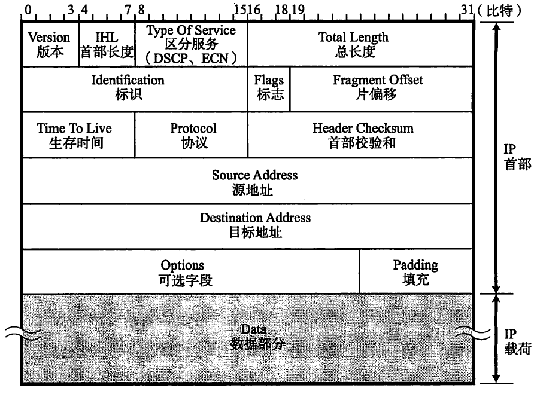
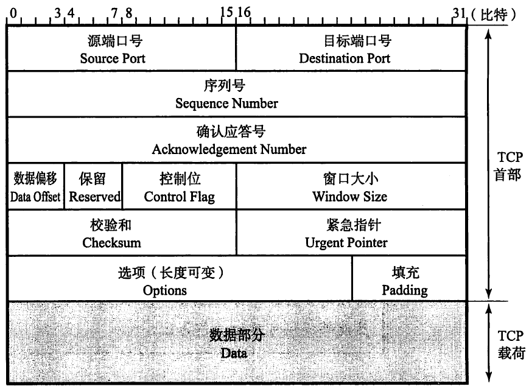
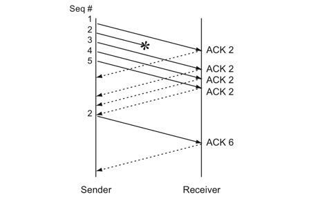

##网络基础知识

###传输方式的分类

* 网络传输方式可分为：面向有连接型、面向无连接型

  面向无连接型包括以太网、IP、UDP 等协议。面向有连接型包括ATM 、帧中继、TCP 等
  协议

* 根据接收端的数量可以分为：单播(Unicast)、广播(Broadcast)、多播(Multicast)、任播(Anycast)

  任播是指在特定的多台主机中选出一台作为接收端的一种通信方式。通常，所被选中的那台特定主机将返回一个单播信号，随后发送端主机会只跟这台主机进行通信。

  任播在实际网络中的应用有DNS 根域名解析服务器。

### TCP/IP基础知识

* TCP/IP 由IETF讨论制定，规范表现为RFC文档。

* TCP/IP协议与OSI七层模型的关系：

  

* IP协议： 非可靠性传输协议

* ICMP： IP 数据包在发送途中一旦发生异常导致无法到达对端目标地址时，需要给发送端发送一个发生异常的通知。ICMP 就是为这一功能而制定的。它有时也被用来诊断网络的健康状况。

* ARP： IP -> MAC， 从分组数据包的IP 地址中解析出物理地址(MAC 地址)的一种协议。

* TCP： 面向连接的可靠的传输层协议，协议复杂，不适用于多媒体数据传输等场景

* UDP： 面向无连接不可靠的传输层协议，常用于分组数据较少或多播、广播通信以及视频通信等多媒体领域。

* HTTP： 用用层协议；HTML： 表示层协议

* TELNET、SSH： 远程登录协议

* SMTP： 邮件协议，依赖于TCP

* FTP： 文件传输协议，建立两个TCP连接

* SNMP:  Simple Network Management Protocol 网络管理协议

* 分层中的包结构：

  

## 数据链路

### 数据链路相关技术

* MAC 地址，48位，唯一性

* 环路检测技术

  网络环路产生的影响：持续转发，导致交换机MAC地址学习混乱、形成广播风暴、造成网络拥塞

  环路检测技术主要有：生成树（建立一个树状的网络拓扑，避免出现环路）、源路由

* VLAN 虚拟局域网

  一组逻辑上的设备和用户，这些设备和用户并不受物理位置的限制，可以根据功能、部门及应用等因素将它们组织起来，相互之间的通信就好像它们在同一个网段中一样。相比于传统的局域网技术，VLAN更加灵活，网络设备的移动、添加和修改的管理开销减少。

  一个VLAN就是一个广播域，不同VLAN之间通信依靠3层设备（因为同一个LAN下数据包转发依靠ARP,ARP获得规则的方法是转发，不同的VLAN属于不同的广播域），好处：区分了广播数据传播的范围、减少了网络负载并提高了网络的安全性

  对简单的VLAN进行扩展，定义了TAG VLAN，在以太网包头部分用VLAN ID进行标识，表示数据包所属的VLAN

  带有VLAN标记以太网帧格式：

  

### 以太网

* IEEE802.3

### PPP

* PPP (Point-to - Point Protocol) 是指点对点，即1 对1 连接计算机的协议。

  使用最广泛的Internet接入方式的数据链路层协议，在用户和ISP之间建立数据链路，优点在于简单、具备用户验证能力、可以解决IP分配等

* PPPoE是在以太网的数据中加入PPP 帧进行传输的一种方式。不仅为使用桥接以太网接入的用户提供了一种宽带接入手段，同时还能提供方便的接入控制和计费。

* PPP主要包含两个协议LCP NCP

  LCP：链路控制协议，不依赖上层，负责链路的建立、参数设置和链路断开

  NCP： 依赖上层协议，如果上层是IP那么NCP主要负责IP地址设置、是否进行TCP/IP首部压缩等

* PPPoE

  在以太网上利用PPPoE提供PPP的功能。单纯的以太网没有验证功能，也没有建立和断开连接的处理，因此无法按时计费。而如果采用PPPoE 管理以太网连接，就可以利用PPP 的验证等功能使各家ISP 可以有效地管理终端用户的使用。

  PPPoE数据包格式：

  

* 其他数据链路： HDMI  Infiniband

### 公共网络

* VPN

## IP协议

* 网络层的主要作用是"实现终端节点之间的通信"。这种终端节点之间的通信也叫"点对点( end-to-end) 通信"。

* IP 包被转发到途中的某个路由时，实际上是装人数据链路层的数据帧以后再被送出。以以太网为例，目标MAC 地址就是下一个路由嚣的MAC地址。

* 路由表（Routing Table）: ，所有主机都维护着一张路由控制表, 该表记录IP 数据在下一步应该发给哪个路由器

* IP分片（IP Fragmentation）: 不同数据链路层的最大传输单位MTU不同，以太网是1500bytes, 当IP层的数据超过MTU就必须进行IP分片

* IP面向无连接的原因： 一是为了简化，二是为了提速。面向连接比起面向无连接处理相对复杂。甚至管理每个连接本身就是一个相当繁琐的事情。此外，每次通信之前都要事先建立连接，又会降低处理速度。需要有连接时，可以委托上一层提供此项服务。因此， IP 为了实现简单化与高速化采用面向无连接的方式。

* IP协议的提供尽力服务（Best Effort）,不提供可靠传输，可靠传输由上层的TCP提供

* 网络分层的意义：方便协议扩展、性能优化  简化了每一个协议的具体实现

* IP地址

  IPv4地址 32bits 长

  由网络地址 主机地址组成（由子网掩码来区分哪几位是主机地址）

  主机地址不可以全部为0 或全部为1 。因为全部为0表示对应的网络地址或IP地址不可获知的情况下才使用。而全部为1 的主机地址通常作为广播地址。

* IP地址分类

  

  | 地址分类 | 公有地址                                   | 私有地址                                           |
  | -------- | ------------------------------------------ | -------------------------------------------------- |
  | A        | 0.0.0.0-127.255.255，其中段0和127不可用    | 10.0.0.0~10.255.255.255  即10.0.0.0/8         |
  | B        | 128.0.0.0-191.255.255.255                  | 172.16.0.0~172.31.255.255 即172.16.0.0/12     |
  | C        | 192.0.0.0-223.255.255.255                  | 192.168.0.0~192.168.255.255  即192.168.0.0/16 |
  | D        | 224.0.0.0-239.255.255.255                  |                                                    |
  | E        | 240.0.0.0-255.255.255.255，其中段255不可用 |                                                    |

* 私有IP地址不能被Internet路由器路由，需要通过网络地址转换NAT转换成公有地址

* 子网掩码

  直接使用A、B类地址会造成浪费，因为主机号部分长，网络号短

  子网掩码是将原来A 类、B 类C 类等分类中的主机地址部分用作子网地址，可以将原网络分为多个物理网络的一种机制。

* 解决IP地址资源紧张的问题

  A地址太少，C地址对应的主机太少，造成很多组织申请B类地址

  * CIDR (Classless Inter-Domain Routing) 无类型域间路由

    将连续多个C类地址划分到一个较大的网络内，例如下图将203.183.224.1~203.183.225.254合并为一个网络，CIDR举例：

    

  * VLSM (Variable Length Subnet Mask) 可变长子网掩码

  * NAT

  * 代理服务器

  * IPv6

* IP分割处理与再构成处理

  IP层的最大MTU 65535字节

  IP数据包长度是8字节的倍数

  由于以太网MTU（1500）的影响，主机、路由器都可能对IP Packet进行分片，目的主机对IP包进行重组

  IP包的重组根据IP首部的“片偏移”，判断一个E数据报是否分片以及当前分片为整个数据报的起始、中段还是末尾。

  为了减少IP数据包在传输过程当中的再次分片（降低路由器负载，提高网络带宽利用率），产生了Path MTU Discovery 路径MTU发现技术，Path MTU指的是路径中存在的所有数据链路中最小的MTU。利用Path MTU发送数据包避免了中途的二次分片。

  路径MTU发现的实现原理：首先在发送端主机发送IP 数据报时将其首部的分片禁止标志位设置为1 。根据这个标志位，途中的路由器即使遇到需要分片才能处理的大包，也不会去分片，而是将包丢弃。随后，通过一个ICMP 的不可达消息将数据链路上M四的值给发送主机。发送端根据ICMP包通知的MTU修改本地的MTU，如此反复，直到发送端收不到任何的ICMP。

  么在TCP 的情况下，根据路径MTU 的大小计算出最大段长度(MSS)，然后再根据这些信息进行数据报的发送。因此，在TCP 中如果采用路径MTU 发现，IP层则不会再进行分片处理。（TCP负责将数据分成IP层不会再被
  分片的粒度以后传给IP层，IP层不再做分片处理。）

* IPv6

  IPv6长度128bit

* IPv4数据包格式

  

  * IHL 首部长度单位为4字节

  * 正常的IPv4头部最少20字节，最长60字节（15*4=60字节）

  * TOS 一个字节

  * RFC2474 :  分为DSCP和ECN两部分：DSCP是6bits（0-5） ECN是2bits（6-7）

    DSCP用来实现服务质量控制（前三个bit可以提供8个服务优先级）

    ECN 显式拥塞通告，用来报告拥塞情况

  * ID 标识： 16bit 用于IP包的分片重组，同一个分片的标识值相同，不同分片的标识值不同。通常，每发送一个IP 包，它的值也逐渐递增。此外，即使ID 相同，如果目标地址、源地址或协议不同的话，也会被认为是不同的分片。

  * Flags: 

    Flags bit0: 未使用

    Flags bit1: 指示是否进行分片

    Flags bit2: 包被分片情况下是否是最后一个包

  * FO（Fragment Offset）:标识被分片的每一个分段相对于原始数据的位置。第一个分片对应的值为0。

  * TTL: 生存时间，可以中转多少个路由器的意思。每经过一个路由器，TTL 会减少1 ，直到变成0 则丢弃包。

### IP协议相关技术

* DNS 域名解析

  域名服务器的结构是一个树状的结构，

* ARP 地址解析协议

  ARP是一种解决地址问题的协议。以目标IP 地址为线索，用来定位下一个应该接收数据分包的网络设备对应的MAC 地址。如果目标主机不在同一个链路上时，可以通过ARP 查找下一跳路由器的MAC 地址

  ARP协议是通过 ARP请求与响应确定MAC地址的，获得的MAC信息会保存在ARP表上，有一定的生存周期

* ICMP Internet控制报文协议

  确认IP 包是否成功送达目标地址，通知在发送过程当中IP 包被废弃的具体原因，改善网络设置等

  在ICMP 中，包以明文的形式，像TCP/UDP 样通过IP 进行传输

  ICMP 的消息大致可以分为两类:一类是通知出错原因的错误消息类型，另一类是用于诊断的查询消息（诊断原因）

  * ICMP 回送信息： 

    用于进行通信的主机或路由器之间，判断所发送的数据包是否已经成功到达对端的一种消息。可以向对端主机发送回送请求的消息（要求接收端返回应答消息），也可以接收对端主机发回来的回送应答消息。

    ping就是基于ICMP 回送消息实现的

* DHCP

  自动设置IP 地址、统一管理IP 地址分配

* NAT 网络地址转换

  NAPT （network address ports translator) 包含端口号的转换， 五元组一致（ip,port,协议类型）才被认为是同一个通信连接

  NAT的缺点：

  * 无法从NAT外部向内部建连接，虽然可以指定端口号允许向内部访问，但是受限于全局IP的数量
  * NAT转换表的生成和转换会产生一定的开销
  * NAT一旦异常需要重启，所有的TCP连接都重置

* IP隧道

  在网络层的首部后面继续追加网络层首部的通信方法就叫做"IP 隧道"，"IP 首部的后面还是IP 首部"或者"IP 首部的后面是IPv6的首部

* 显式的拥塞控制  ECN

  为什么TCP提供了拥塞控制，IP层还需要显式的拥塞控制？ TCP拥塞控制的缺点？

  ​	TCP 虽然也能控制网络拥塞，不过它是通过数据包的实际损坏情况来判断是否发生拥塞。然而这种方法并不能在数据包损坏之前减少数据包的发送量。

  ECN 的机制概括起来就是在发送包的IP 首部中记录路由器是否遇到拥塞，并在返回包的TCP 首部中通知是否发生过拥塞。

  * ECN的IP包头字段

    TOS字节最后两位是ECN字段，ECT 和 CE

    路由转发对ECN的支持：

    * 当拥塞发生时，针对ECN=00的报文，走原有普通非ECN流程，即，进行RED丢包。

    * 当拥塞发生时，针对ECN=01或ECN=10的报文，都需要修改为ECN=11，并继续转发流程。

    * 当拥塞发生时，针对ECN=11的报文，需要继续转发。

    * 为了保证与不支持ECN报文的公平性，在队列超过一定长度时，需要考虑对支持ECN报文的丢弃。

      TCP首部的修改

  * ECN的TCP包头部分

    因为只有TCP层才能对拥塞进行相应的发送控制，所以返回包中在TCP层通知拥塞

    TCP首部的bit8 和 bit9 字段修改为 CWR（拥塞窗口减小） 和 ECE

    * TCP层收到IP首部 ECN=11的包是，在响应包中标记ECE=1
    * 发送方接收到ECE=1后，减小拥塞窗口，并在返回的包中标记CWR=1，用来确认已经收到了拥塞通知，后续的ECE将不再等于1直到再次收到ECN=11

##TCP协议

* 常见的知名端口号

  FTP 21

  SSH 22

  Telnet 23

  HTTP 80

  HTTPS 443

* TCP/IP中确认一个通信是通过五元组确认，包括：srcip dstip 协议（TCP/UDP） srcport dstport

* TCP的超时重传

* TCP以段为单位发送数据

  在建立TCP 连接的同时，也可以确定发送数据包的单位，我们也可以称其为"最大消息长度" ( MSS: Maximum Segment Size) 。最理想的情况是，最大消息长度正好是IP 中不会被分片处理的最大数据长度。

  MSS 是在三次握手的时候，在两端主机之间被计算得出。两端的主机在发出建立连接的请求时，会在TCP 首部中写人MSS 选项，告诉对方自己的接口能够适应的MSS 的大小气然后会在两者之间选择一个较小的值投入使用。

  窗口的最小单位是段

* 流控制

* 拥塞控制

* TCP首部格式

  

  

  * Data Offset 数据偏移，表示TCP的首部长度，单位是4字节，所以TCP首部最长为15*4=60字节

### TCP状态图

* tcp状态图

  

* 三次握手与四次挥手状态图

  

* 三次握手

  初始化Sequence Number, 序列号解决了数据包的乱序到达问题

* 四次挥手

  当通信双方同时收到对方的FIN包时，就都会进入到closing的状态，收到ACK以后，就进入Time wait阶段，等待2*MSL（Maximum Segment Life）的时间

* 建连接SYN超时

  server端接到了clien发的SYN后回了SYN-ACK后client掉线了，server端没有收到client回来的ACK，那么，这个连接处于一个中间状态，即没成功，也没失败。于是，server端如果在一定时间内没有收到的TCP会重发SYN-ACK。在Linux下，默认重试次数为5次，重试的间隔时间从1s开始每次都翻售，5次的重试时间间隔为1s, 2s, 4s, 8s, 16s，总共31s，第5次发出后还要等32s都知道第5次也超时了，所以，总共需要 1s + 2s + 4s+ 8s+ 16s + 32s = 2^6 -1 = 63s，TCP才会把断开这个连接。 

  利用SYN超时，制造SYN Flood攻击，耗尽服务器的资源

* Time wait 与 MSL

   1）TIME_WAIT确保有足够的时间让对端收到了ACK，如果被动关闭的那方没有收到Ack，就会触发被动端重发Fin，一来一去正好2个MSL，2）有足够的时间让这个连接不会跟后面的连接混在一起（你要知道，有些自做主张的路由器会缓存IP数据包，如果连接被重用了，那么这些延迟收到的包就有可能会跟新连接混在一起）。 为了防止已失效的报文段出现在下一次连接中 

  Time wait时间设置的过长，就会消耗很多的系统资源，time wait的问题只存在于主动断连接的一方

* 传输过程中的Sequence Number的变化

  SeqNum的增加是和传输的字节数相关的，一组TCP请求响应中，srcSeq+dataLen=dstACKNum

  ACKNum-ISN表示已经接受了多少的字节数据

  SeqNum-ISN表示已经发送了多少字节的数据

### TCP的重传机制

* ACK机制： SeqNum和Ack是以字节数为单位，所以ack的时候，不能跳着确认，只能确认**最大的连续收到的包**，不然，发送端就以为之前的都收到了。
* TCP的ACK机制分为 快速ACK和延迟ACK，延迟ACK能减少发送的分段从而节省了带宽，而快速ACK能及时通知发送方丢包，避免滑动窗口停等，提升吞吐率 
* 延迟ACK的机制：
  1. 当有响应数据发送的时候，ACK会随着数据一块发送 
  2. 如果没有响应数据，ACK就会有一个延迟，以等待是否有响应数据一块发送，但是这个延迟一般在40ms~500ms之间，一般情况下在40ms左右，如果在40ms内有数据发送，那么ACK会随着数据一块发送 这样做可以合并ACK包，最多两个ACK合并为一个，同时也可以避免发送单独的ACK包（把接收端发送的数据放到数据包里）
  3. 如果在等待发送ACK期间，第二个数据又到了，这时候就要立即发送ACK 

####TCP超时重传

* TCP根据RTT（Round Trip Time）来设置合适的RTO（Retransmission Timeout）

* 计算RTO有很多算法，RFC793定义了一个经典的算法—加权移动平均算法（Exponential weighted moving average ）

  平滑的RTT, SRTT
  $$
  SRTT=(\alpha*SRTT)+((1-\alpha)*RTT) \quad \alpha \epsilon(0.8, 0.9)
  $$

$$
RTO=min[UBOUND, max[LBOUND , (\beta*SRTT)]]\quad \beta\epsilon(1.3, 2.0)
$$

​	UBOUND timeout的上限值  LBOUND timeout的下限值

​	针对经典的加权移动平均算法，有很多改进

#### TCP的快重传 Fast Retransmit 

TCP引入了一种叫**Fast Retransmit** 的算法，**不以时间驱动，而以数据驱动重传**。也就是说，如果，包没有连续到达，就ack最后那个可能被丢了的包，如果发送方连续收到3次相同的ack，就重传。Fast Retransmit的好处是不用等timeout了再重传。 

发送端接收到3个ACK=2后，就知道2丢了

快重传只是解决了timeout的问题，但是还面临一个问题，即是只重传ACK对应的包还是重传之后所有的包

#### SACK(Selective Acknowledgment) 选择确认机制

在TCP头部上加上SACK，SACK则是汇报收到的数据碎版 

#### D-SACK

### TCP 滑动窗口（Sliding Window ）

* TCP通过滑动窗口来做 流量控制（Flow Control）

* TCP头部的window字段，又叫AdvertisedWindow ，这个字段是接收端告诉发送端自己还有多少缓冲区可以接收数据**。**于是发送端就可以根据这个接收端的处理能力来发送数据，而不会导致接收端处理不过来。

  

  * LastByteRead  接收端TCP缓冲区读到的位置
  * NextByteExpected 收到的连续包的最后一个位置
  * LastByteRcved 指向的是收到的包的最后一个位置 
  * LastByteAcked 指向了被接收端Ack过的位置（表示成功发送确认） 
  * LastByteSent 发送端已发出，但是还没有成功确认的ACK（LastByteAcked—LastByteSent之间都是已经发送还是没有收到确认）
  * LastByteWritten 指向的是上层应用正在写的地方 
  * 接收端返回的ACK包中，告诉发送端自己的AdvertisedWindow=MaxRcvBuffer – LastByteRcvd – 1

* ##### Zero Window

  发送端的窗口被降为0，会发ZWP(Zero Window Probe 主动探测)的包给接收方，让接收方来ack他的Window尺寸，一般这个值会设置成3次，第次大约30-60秒（不同的实现可能会不一样）。如果3次过后还是0的话，有的TCP实现就会发RST把链接断了。 

* ##### Silly Window Syndrome

  接收方来不及取走receive window里的数据，就会导致发送方的窗口越来越小，最后导致为了发送很少的数据量却产生更大的开销（TCP+IP首部最少也有40字节）

### TCP 拥塞控制 Congestion Handling

### TCP协议相关博文

[TCP的那些事儿（上）](https://coolshell.cn/articles/11564.html)

[TCP的那些事儿（下）](https://coolshell.cn/articles/11609.html)

[在深谈TCP/IP三步握手&四步挥手原理及衍生问题—长文解剖IP](http://www.morekpi.com/1046.html)

