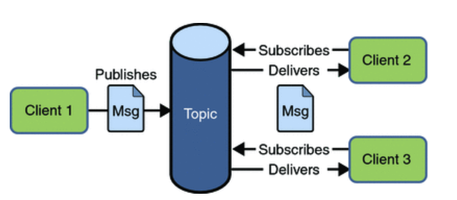

## 数据通信

### RPC

**Remote Procedure Call** 远程过程调用，<u>通过网络从远程计算机程序上请求服务，而不需要了解底层网络技术的协议</u>。RPC协议假定某些传输协议的存在，如TCP或UDP，为通信程序之间携带信息数据。在OSI网络通信模型中，RPC跨越了传输层和应用层。<u>RPC使得开发分布式程序就像开发本地程序一样简单。</u> 

使得分布式系统中的服务调用问题，使得调用者感知不到远程调用的逻辑，就像在执行本地调用一样。

目前Java使用比较多的RPC方案主要有**RMI**（Remote Method Invocation ）（JDK自带）、**Hessian**（http）、**Dubbo**(tcp)以及**Thrift**(tcp/http transport)等。

Java中RPC经常跟Spring的IOC一起使用，当本地需要调用远程主机上的对象方法时，spring会创建一个代理对象，这个代理对象内部是通过RPC来实现方法的调用的。

RPC调用过程

* Application就是rpc的调用方
* Client Stub就是我们上面说到的代理对象，也就是那个看起来像是真实的实现类，其实内部是通过rpc方式来进行远程调用的代理对象
* 至于Client Run-time Library，则是实现远程调用的工具包，比如jdk的Socket，最后通过底层网络实现实现数据的传输。

RPC涉及到java的序列化和反序列化

* **RPC 和 RMI的区别**

  RMI是java自带的访问远程对象的协议；Dubbo等rpc框架里面可以选择使用很多具体的协议实现如：rmi,dubbo协议

## Dubbo

* Dubbo是一个rpc框架，主要的功能包括：面向接口的远程方法调用，智能容错，负载均衡，服务自动注册和发现

* Dubbo框架图

  

  * **Provider：** 暴露服务的服务提供方
  * **Consumer：** 调用远程服务的服务消费方
  * **Registry：** 服务注册与发现的注册中心; 注册中心负责返回服务提供者的地址列表给消费者，注册中心与消费方和提供方之间是长连接，如果有变更，注册中心将基于长连接推送变更数据给消费者。
  * **Monitor：** 统计服务的调用次数和调用时间的监控中心
  * **Container：** 服务运行容器

* Dubbo的负载均衡策略

  * 基于权重的随机负载均衡
  * 基于权重的轮询负载均衡
  * 基于活跃数（调用前后的时间差）的均衡
  * 基于一致性Hash的负载均衡

* Zookeeper注册中心宕机

  * 监控中心宕掉不影响使用，只是丢失部分采样数据
  * 数据库宕掉后，注册中心仍能通过缓存提供服务列表查询，但不能注册新服务
  * 注册中心对等集群，任意一台宕掉后，将自动切换到另一台
  * 注册中心全部宕掉后，服务提供者和服务消费者仍能通过本地缓存通讯
  * 服务提供者无状态，任意一台宕掉后，不影响使用
  * 服务提供者全部宕掉后，服务消费者应用将无法使用，并无限次重连等待服务提供者恢复

## 消息队列

* 使用消息队列的意义

  * 通过异步处理提高系统的性能（流量削峰、提高响应速度）

  * 降低系统的耦合性

    消息队列使利用**发布-订阅模式**工作，消息发送者（生产者）发布消息，一个或多个消息接受者（消费者）订阅消息。从上图可以看到<u>消息发送者（生产者）和消息接受者（消费者）之间没有直接耦合</u>

    消息队列模式除了发布订阅模式，还有点对点模式（一个消息只有一个消费者）

* 消息队列带来的问题

  * 消息有没有重复消费、消费顺序、处理消息丢失
  * 一致性问题，消费者没有正确的消费消息
  * 系统的复杂度提高

* 点对点（一个消息只能被一个消费者消息）

  

* 发布订阅 

  使用**主题（Topic）**作为消息通信载体，类似于**广播模式**；发布者发布一条消息，该消息通过主题传递给所有的订阅者，**在一条消息广播之后才订阅的用户则是收不到该条消息的**。 

  

   

* 常见的消息队列

  * ActiveMQ性能最差 万级别的吞吐量
  * RabbitMQ 吞吐量比 RocketMQ  Kafka差, 基于erlang语言，但是延时很低，微秒级延时，其他的都是ms级别的延时
  * RocketMQ 阿里开源的Java项目
  * Kafka 功能较为简单，主要支持简单的MQ功能，在大数据领域的实时计算以及日志采集被大规模使用，是事实上的标准 

 

 

